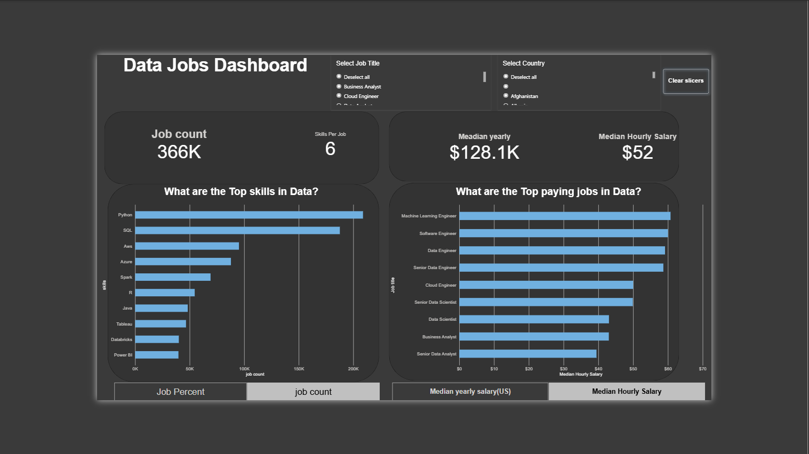

# Data Jobs Dashboard w/ Power BI

## Introduction

Understanding the data job market can be challenging when information about job demand, skills, and salaries is spread across a large dataset. This **Data Jobs Dashboard** was created in Power BI to provide a concise and interactive view of the data job market.

The dashboard helps users explore **job demand, in-demand skills, and salary trends** while allowing them to filter the analysis by **Job Title** and **Country**.

### Dashboard File

You can find the Power BI dashboard file here: ### Dashboard File

📁 **[Download the Power BI Dashboard (.pbix)](https://drive.google.com/file/d/1XGqZB3f7g9Al1MRdkTkXye3o-i7qfU8Z/view?usp=drive_link)**

## Skills Showcased

This project provided hands-on practice with several important Power BI concepts:

* **🎨 Dashboard Design:** Creating a clean, structured, and user-friendly dashboard layout.
* **⚙️ Power Query:** Cleaning, transforming, and preparing the dataset for analysis.
* **🔗 Data Modeling:** Working with data relationships and creating a model suitable for reporting.
* **🧮 DAX:** Creating measures and calculations for job counts, skill counts, skills per job, and salary analysis.

* **📊 Data Visualization:**
    * **📈 Bar Charts:** Comparing the most in-demand skills and highest-paying data jobs.
    * **🔢 Cards:** Displaying key KPIs such as Job Count, Skills Per Job, Median Yearly Salary, and Median Hourly Salary.
    * **📋 Tables/Visual Elements:** Presenting analytical results in an easy-to-understand format.

* **🖱️ Interactive Features:**
    * **🎚️ Slicers:** Filtering the dashboard by Job Title and Country.
    * **🔘 Buttons:** Clearing slicer selections and improving dashboard navigation.
    * **🔄 Dynamic Analysis:** Switching between different measures such as job percentage, job count, median yearly salary, and median hourly salary.

---

## Dashboard Overview

The dashboard provides a single-page overview of the data job market.

The dashboard highlights several important metrics and comparisons:

* **Job Count:** 366K jobs represented in the dashboard.
* **Skills Per Job:** 6 skills per job.
* **Median Yearly Salary:** $128.1K.
* **Median Hourly Salary:** $52.
* **Top Skills in Data:** Python, SQL, AWS, Azure, Spark, R, Java, Tableau, Databricks, and Power BI.
* **Top Paying Data Jobs:** Machine Learning Engineer, Software Engineer, Data Engineer, Senior Data Engineer, Cloud Engineer, Senior Data Scientist, Data Scientist, Business Analyst, and Senior Data Analyst.

The slicers allow users to narrow the analysis by **Job Title** and **Country**, making it easier to explore specific segments of the data job market.

---

## Key Insights

The dashboard makes it possible to quickly identify:

* Which technical skills appear most frequently across data job postings.
* Which data-related roles have higher median salaries.
* How job demand can be compared using job count and job percentage.
* How compensation can be evaluated using both yearly and hourly median salary.
* How job-market insights change when different job titles or countries are selected.

---

## Conclusion

This project demonstrates how **Power BI can transform raw job-posting data into an interactive analytical dashboard**.

By combining **Power Query, data modeling, DAX, slicers, and visualizations**, the dashboard provides a practical way to explore the relationship between **job demand, required skills, and compensation** in the data job market.

This project also strengthened my understanding of building an end-to-end Power BI dashboard and presenting data-driven insights in a clear and interactive format.
